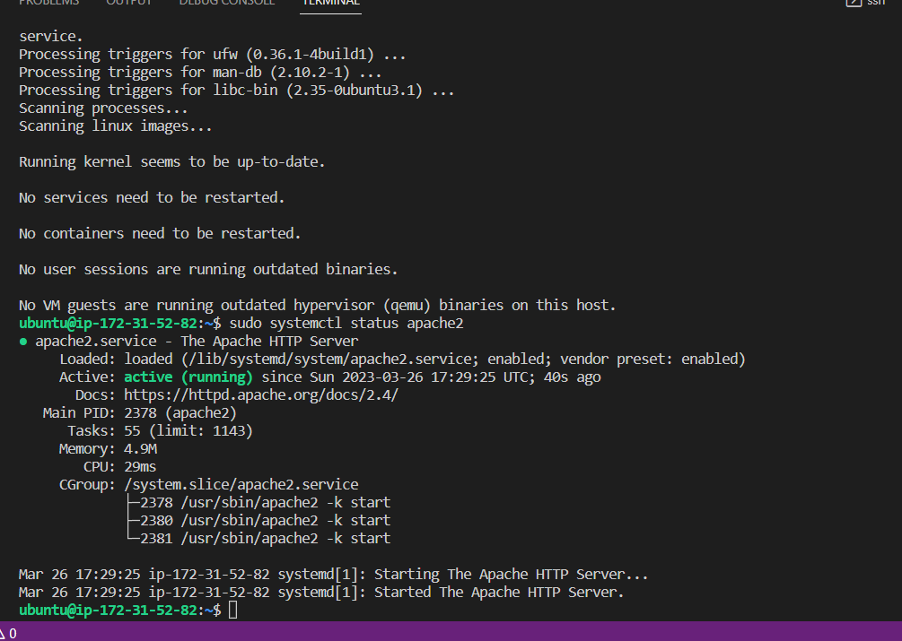
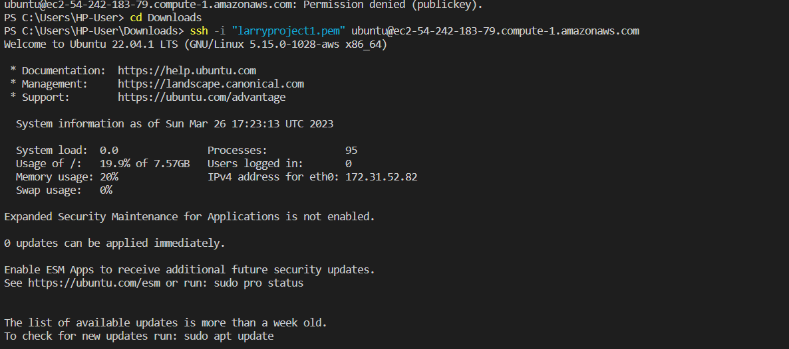
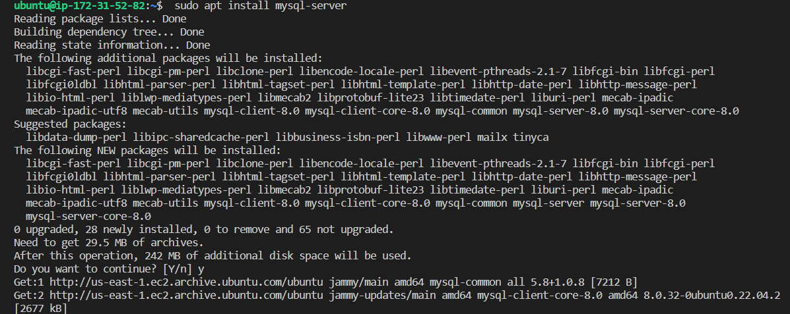
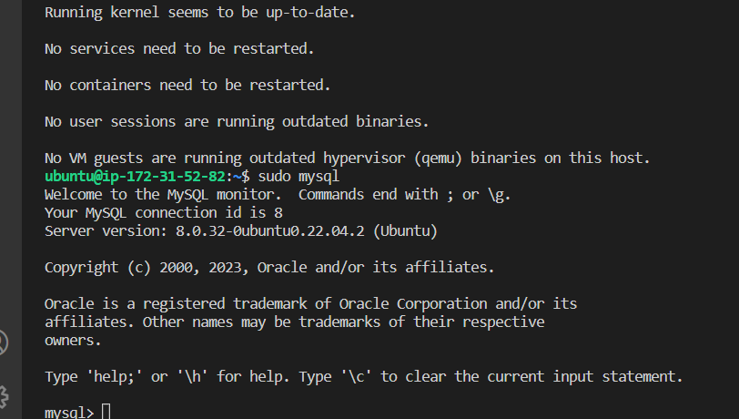
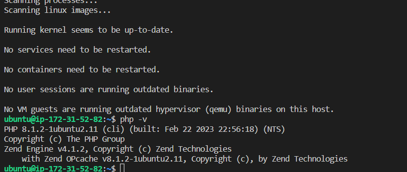
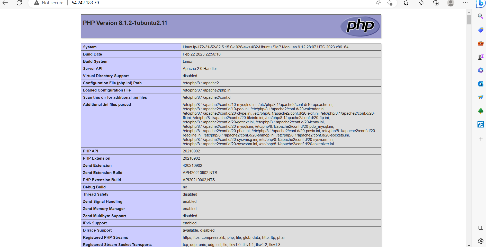

# WEB STACK IMPLEMENTATION (LAMP STACK) IN AWS

'git clone git@github.com:princelarrytpapa/projectt111.git'

'cd Downloads'

'ssh -i "larryproject1.pem" ubuntu@ec2-54-242-183-79.compute-1.amazonaws.com'

'sudo apt update'

'sudo apt install apache2'

'sudo systemctl status apache2'

'curl http://localhost:80'

http://http://54.242.183.79/:80

'sudo apt install mysql-server'

'sudo mysql'

'sudo mysql_secure_installation'

'exit'

'sudo apt install php libapache2-mod-php php-mysql'

'php -v'

'sudo mkdir /var/www/projectlamp'

'sudo chown -R $USER:$USER /var/www/projectlamp'

'sudo vi /etc/apache2/sites-available/projectlamp.conf'

'<VirtualHost *:80>
    ServerName projectlamp
    ServerAlias www.projectlamp 
    ServerAdmin webmaster@localhost
    DocumentRoot /var/www/projectlamp
    ErrorLog ${APACHE_LOG_DIR}/error.log
    CustomLog ${APACHE_LOG_DIR}/access.log combined
</VirtualHost>'

'sudo ls /etc/apache2/sites-available'

'sudo a2ensite projectlamp'

'sudo a2dissite 000-default'

'sudo apache2ctl configtest'

'sudo systemctl reload apache2'

'sudo echo 'Hello LAMP from hostname' $(curl -s http://54.242.183.79/latest/meta-data/public-hostname) 'with public IP' $(curl -s http://54.242.183.79/latest/meta-data/public-ipv4) > /var/www/projectlamp/index.html'

'http://54.242.183.79:80'

'sudo vim /etc/apache2/mods-enabled/dir.conf'

'<IfModule mod_dir.c>
        #Change this:
        #DirectoryIndex index.html index.cgi index.pl index.php index.xhtml index.htm
        #To this:
        DirectoryIndex index.php index.html index.cgi index.pl index.xhtml index.htm
</IfModule>'

'sudo systemctl reload apache2'

'vim /var/www/projectlamp/index.php'

'<?php
phpinfo();'

'sudo rm /var/www/projectlamp/index.php'

